# CredLayer

# CredLayer

<p align="center">
  
</p>

---

## 🚀 **Project Status**

### **✅ Fully Integrated Full-Stack Application**

**Backend API (FastAPI)**
- ✅ 9 Complete Endpoints (scores, credentials, connections, agents, activity, settings, api-keys, webhooks, request-logs)
- ✅ 7 Database Migrations (PostgreSQL/SQLite ready)
- ✅ Structured logging with error handling
- ✅ CORS configured for frontend
- ✅ Envelope response pattern
- ✅ Running on `http://localhost:8000/api/v1`

**Frontend (Next.js 16 + React 19)**
- ✅ Complete UI with 11 pages wired to real data
- ✅ 9 SWR data hooks (no placeholders)
- ✅ Workspace: Dashboard, Profile, Analysis, Credentials, Activity, Agents, Settings
- ✅ Developer Portal: API Keys, Request Logs, Documentation, SDK
- ✅ Solana wallet integration
- ✅ Real-time data fetching with loading/error states

**Blockchain (Solana)**
- ✅ Sign Attestation System (SAS) integration
- ✅ On-chain credential verification
- ✅ SDK for attestation management
- ✅ Relayer for gasless transactions

**Status**: Production-ready MVP with full backend-frontend integration

---

<p align="center">
  
</p>

## Decentralized Reputation Infrastructure for Web3

CredLayer is a **B2B Web3 trust, risk, and reputation infrastructure platform**.

The platform analyzes blockchain activity, wallet behavior, transaction patterns, and other behavioral signals to generate intelligent reputation and risk assessments.

Instead of asking:

> "Who is this wallet?"

CredLayer helps applications ask:

> **"Can I trust this wallet, and what evidence supports that decision?"**

CredLayer is designed to provide this intelligence to:

- DeFi protocols
- Lending platforms
- Web3 applications
- DAOs
- Exchanges
- Fintech applications
- Blockchain infrastructure companies
- AI-agent platforms
- Developers building trust-aware applications

---

# 🧩 The Problem

Web3 is permissionless, but permissionless systems create a major trust problem.

A wallet address doesn't tell an application:

- Whether the wallet behaves responsibly
- Whether it has interacted with risky contracts
- Whether its transaction behavior is suspicious
- Whether it has a consistent on-chain history
- Whether an AI agent should trust it
- Whether a protocol should extend credit
- Whether a user represents meaningful financial risk

Most applications still rely on limited signals such as:

```text
Wallet Address
      ↓
Transaction History
      ↓
Basic Rules
      ↓
Decision

CredLayer introduces an intelligence layer:

On-Chain Activity
        ↓
Behavioral Analysis
        ↓
Risk Detection
        ↓
AI Intelligence
        ↓
Reputation Score
        ↓
Verifiable Trust Signal
        ↓
Application Decision


---

💡 Our Solution

CredLayer converts raw blockchain activity into a structured reputation layer.

Core pipeline

┌───────────────────────┐
│   Blockchain Data     │
│ Solana / Other Chains │
└───────────┬───────────┘
            ↓
┌───────────────────────┐
│   Wallet Analysis     │
│ Transactions & Events │
└───────────┬───────────┘
            ↓
┌───────────────────────┐
│ Behavioral Analytics  │
│ Risk & Activity       │
└───────────┬───────────┘
            ↓
┌───────────────────────┐
│      AI Engine        │
│ Pattern Recognition   │
└───────────┬───────────┘
            ↓
┌───────────────────────┐
│ Reputation & Risk     │
│       Score           │
└───────────┬───────────┘
            ↓
┌───────────────────────┐
│ Verifiable Trust Data │
└───────────────────────┘


---

🔐 Core Features

1. Wallet Reputation

Generate reputation intelligence from wallet behavior.

Signals can include:

Transaction history

Wallet age

Transaction frequency

Contract interactions

Asset activity

Behavioral consistency

Risk indicators

Historical activity patterns


---

2. AI-Powered Risk Analysis

CredLayer uses AI to identify patterns that traditional rule-based systems can miss.

The AI layer can help detect:

Suspicious behavioral patterns

Unusual transaction activity

Risky interactions

Behavioral anomalies

Potential fraud indicators

Reputation changes


---

3. Reputation Scoring

Convert complex behavioral data into a simple, interpretable reputation score.

Example:

CredLayer Reputation

Score: 842 / 1000

Trust Level
██████████████████░░ 84%

Risk Level
████░░░░░░░░░░░░░░░░ 18%

Behavior Consistency
████████████████░░░░ 82%

The scoring system is designed to become portable across applications and ecosystems.


---

🌐 Web3 Trust Infrastructure

CredLayer is not intended to be another standalone analytics dashboard.

The long-term goal is to provide infrastructure that other applications can integrate directly.

CredLayer
                       │
        ┌──────────────┼──────────────┐
        ↓              ↓              ↓
     DeFi Apps      AI Agents      Fintech
        │              │              │
        └──────────────┼──────────────┘
                       ↓
                Trust Intelligence

Applications can use CredLayer to make better decisions around:

Lending

Access control

User onboarding

Risk assessment

Transaction monitoring

Agent-to-agent interactions

Reputation-based permissions


---

🧑‍💻 Developer Platform

CredLayer is being designed with developers as a first-class user.

Developers should be able to integrate reputation intelligence without needing to build their own blockchain analytics infrastructure.

Developer capabilities

Reputation API

Wallet analysis API

Risk analysis API

Developer dashboard

API keys

Usage monitoring

SDKs

Webhooks

Documentation

Multi-chain adapters


Example API concept

GET /api/v1/reputation/{wallet}

Example response:

{
  "wallet": "7xK...9LmP",
  "reputationScore": 842,
  "riskLevel": "low",
  "confidence": 0.91,
  "network": "solana"
}


---

🤖 AI Agent Trust

One of CredLayer's long-term opportunities is AI-agent reputation.

As autonomous AI agents begin interacting with:

wallets

protocols

smart contracts

marketplaces

financial systems

other agents


they will need reliable trust signals.

CredLayer can provide an intelligence layer that helps agents answer:

Who am I interacting with?
        ↓
What is their historical behavior?
        ↓
What is their reputation?
        ↓
What is their risk?
        ↓
Should I interact?


---

⛓️ Blockchain Architecture

CredLayer is initially focused on Solana, while the architecture is designed for future multi-chain expansion.

Current focus

Solana
  │
  ├── Wallet Activity
  ├── Transactions
  ├── Program Interactions
  ├── Behavioral Signals
  └── Reputation Intelligence

Future architecture

CredLayer
                  │
       ┌──────────┼──────────┐
       ↓          ↓          ↓
    Solana      Chain B    Chain C
       │          │          │
       └──────────┼──────────┘
                  ↓
          Unified Reputation


---

🏗️ Architecture

┌────────────────────────────────────────────┐
│                  Frontend                  │
│              Next.js / React               │
└──────────────────────┬─────────────────────┘
                       │
                       ↓
┌────────────────────────────────────────────┐
│                    API                     │
│          Node.js / Express / FastAPI       │
└───────────────┬───────────────┬────────────┘
                │               │
                ↓               ↓
       ┌────────────────┐ ┌───────────────┐
       │ Blockchain     │ │ AI Engine     │
       │ Data Layer     │ │ Risk Analysis │
       └───────┬────────┘ └───────┬───────┘
               │                  │
               └────────┬─────────┘
                        ↓
              ┌────────────────────┐
              │ Reputation Engine  │
              └──────────┬─────────┘
                         ↓
              ┌────────────────────┐
              │ Database / Cache   │
              └────────────────────┘


---

🛠️ Technology Stack

Frontend

Next.js

React

TypeScript

Tailwind CSS

Framer Motion


Backend

Node.js

Express.js / FastAPI

PostgreSQL

Prisma

Redis

REST APIs


AI

Python

Machine Learning / AI models

Behavioral analysis

Risk classification

Reputation scoring


Blockchain

Solana

Rust

Solana Programs

Helius / blockchain data providers

Future multi-chain adapters


Infrastructure

Docker

GitHub Actions

Vercel

Railway / cloud infrastructure

Cloudflare


---

🔌 Developer Integration

CredLayer will provide multiple integration methods.

JavaScript / TypeScript

const reputation = await credlayer.wallet.analyze({
  address: walletAddress,
  chain: "solana"
});

console.log(reputation.score);

Python

result = credlayer.wallet.analyze(
    address=wallet_address,
    chain="solana"
)

print(result["score"])

REST API

curl https://api.credlayer.xyz/v1/reputation/WALLET_ADDRESS


---

📊 Reputation Model

CredLayer's reputation engine can combine multiple behavioral signals.

Reputation
                      │
       ┌──────────────┼──────────────┐
       ↓              ↓              ↓
 Transaction      Wallet          Risk
  Behavior         History        Signals
       │              │              │
       └──────────────┼──────────────┘
                      ↓
                AI Analysis
                      ↓
              Reputation Score

The model should remain explainable and provide supporting signals rather than producing an unexplained score.


---

👥 Target Customers

CredLayer is primarily a B2B infrastructure product.

Target customers

DeFi

Lending protocols

Borrowing platforms

DEXs

Credit protocols


Web3

Wallets

DAOs

Marketplaces

Infrastructure providers

Web3 applications


AI

Autonomous agents

Agent marketplaces

Agent infrastructure

AI-to-AI transaction systems


Fintech

Digital financial platforms

Blockchain-enabled fintech

Credit infrastructure


---

👨‍💻 Team

Core Engineering

Frontend Engineers

Build the user interface and developer dashboard

Integrate wallet connectivity

Build analytics and visualization interfaces


Backend Engineers

Build APIs

Database architecture

Authentication

Data pipelines

Developer platform


AI Engineers

Behavioral analysis

Risk models

Reputation scoring

AI inference infrastructure


Blockchain / Solana Engineers

Solana programs

On-chain verification

Blockchain integrations

Developer tooling


Product Designers

Product experience

Design system

Developer experience

Enterprise UX


Community & Growth

Developer adoption

Partnerships

Ecosystem growth

Community


---

🗺️ Development Roadmap

Phase 1 — Foundation

[x] Core product architecture

[ ] Backend infrastructure

[ ] Database architecture

[ ] Frontend implementation

[ ] Authentication

[ ] Wallet integration


---

Phase 2 — Reputation Engine

[ ] Wallet data ingestion

[ ] Behavioral analysis

[ ] AI analysis engine

[ ] Reputation scoring

[ ] Risk classification

[ ] Explainable reputation signals


---

Phase 3 — Solana Integration

[ ] Solana data integration

[ ] Solana programs

[ ] On-chain verification

[ ] Wallet analysis

[ ] Verifiable reputation records


---

Phase 4 — Developer Platform

[ ] Public API

[ ] Developer dashboard

[ ] API keys

[ ] SDK

[ ] Webhooks

[ ] API usage analytics

[ ] Developer documentation


---

Phase 5 — Multi-Chain

[ ] Additional blockchain adapters

[ ] Cross-chain reputation

[ ] Portable reputation

[ ] Unified trust layer


---

🧪 Development Principles

CredLayer is being built around several principles:

Security First

User assets and private keys should never be exposed to CredLayer.

Explainable Intelligence

Reputation scores should be supported by understandable behavioral signals.

Privacy

Only necessary information should be processed.

Verifiability

Important reputation claims should be capable of being independently verified.

Developer First

Integration should be simple enough that developers can add CredLayer without rebuilding their infrastructure.

Modular Architecture

Blockchain, AI, reputation, and API layers should remain independently extensible.


---

🔒 Security Model

CredLayer is designed as a non-custodial infrastructure layer.

CredLayer should never require:

❌ Private Keys
❌ Seed Phrases
❌ Wallet Custody
❌ Unauthorized Transactions

The system should primarily work with:

Public Wallet Address
        ↓
Blockchain Data
        ↓
Behavior Analysis
        ↓
Risk / Reputation Intelligence

Wallet signatures should only be requested when an application feature genuinely requires cryptographic proof of wallet ownership.


---

📁 Project Structure

A high-level structure:

credlayer/
│
├── frontend/
│   ├── app/
│   ├── components/
│   ├── lib/
│   └── public/
│
├── backend/
│   ├── src/
│   ├── routes/
│   ├── services/
│   ├── models/
│   └── middleware/
│
├── ai/
│   ├── models/
│   ├── pipelines/
│   ├── analysis/
│   └── scoring/
│
├── blockchain/
│   ├── programs/
│   ├── clients/
│   └── integrations/
│
├── sdk/
│   ├── javascript/
│   └── python/
│
└── docs/


---

🌍 Vision

CredLayer aims to become the trust infrastructure of Web3.

As decentralized applications become more autonomous, applications need a reliable way to understand who — or what — they are interacting with.

Our vision is a future where:

Every Wallet
     +
Every Application
     +
Every AI Agent
     ↓
Can Understand Reputation
     ↓
Before Interacting

CredLayer is building the infrastructure for a more trusted, intelligent, and secure decentralized ecosystem.


---

🚀 Why CredLayer?

> Identity tells you who someone is.

CredLayer helps you understand how they behave.


That behavioral intelligence can become the foundation for better decisions across Web3.


---

🤝 Contributing

We welcome developers, researchers, designers, and Web3 builders interested in trust infrastructure.

If you want to contribute:

git clone <repository-url>

cd credlayer

npm install

npm run dev

Check the project issues and documentation before starting major changes.


---

📄 License

This project is licensed under the MIT License.


---

<div align="center">CredLayer

Trust the behavior. Verify the reputation. Secure the interaction.

Built for a more trustworthy Web3.

</div>
```For the terminal animation

Put the animation here:

credlayer/
└── assets/
    ├── credlayer-logo.png
    └── credlayer-terminal.gif

The animation should look like a real CredLayer terminal boot sequence, for example:

$ credlayer init

Initializing CredLayer...

[✓] Blockchain connection
[✓] Wallet analysis engine
[✓] AI reputation engine
[✓] Risk detection
[✓] Verification layer

Analyzing wallet...

> Reputation Score: 842/1000
> Risk Level: LOW
> Confidence: 91%

CredLayer Intelligence Layer
STATUS: ONLINE
